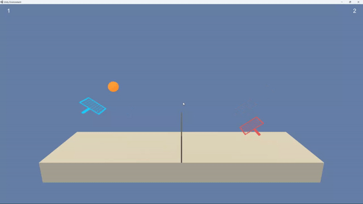
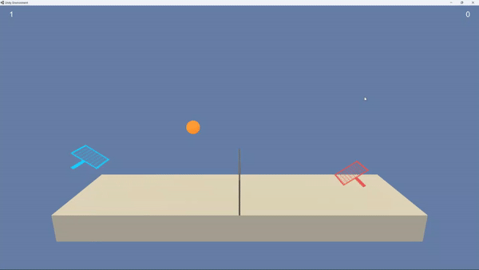

# Solving Tennis Environment with Multi Agent Reinforcement Learning


|             Random Agent             |             Trained Agent             |
|:------------------------------------:|:-------------------------------------:|
|  |  |


## 1. Introduction
In this project, we work with the 
[Tennis](https://github.com/Unity-Technologies/ml-agents/blob/master/docs/Learning-Environment-Examples.md#tennis)
environment where we have two agents that play against each other. Each agent receives a 
reward of +0.1 if it hits the ball over the net and a reward of -0.01 if it lets the ball
hit the ground or hits the ball out of bounds. The goal is to keep the ball in play as long
as possible.

* __Goal__: Get an average score of +0.5 over 100 consecutive episodes.

* __Observation space__: Each agent has its own local observation space which consists of 24 
variables corresponding to the position and velocity of the ball and racket.

* __Action space__: We have two actions each with continuous domain between -1 and
+1 corresponding to the agent's movement (left and right), and jumping.

* __Algorithm__: To train the agent, we used a multi-agent actor-critic method called 
__Multi Agent Deep Deterministic Policy Gradient (MADDPG)__. 


## 2. Installation

### 2.1. Environment
First, you need to download the environment according to the Operating System:
* Linux: [[Download]](https://s3-us-west-1.amazonaws.com/udacity-drlnd/P3/Tennis/Tennis_Linux.zip)
* Mac OS: [[Download]](https://s3-us-west-1.amazonaws.com/udacity-drlnd/P3/Tennis/Tennis.app.zip)
* Windows 32bit: [[Download]](https://s3-us-west-1.amazonaws.com/udacity-drlnd/P3/Tennis/Tennis_Windows_x86.zip)
* Windows 64bit: [[Download]](https://s3-us-west-1.amazonaws.com/udacity-drlnd/P3/Tennis/Tennis_Windows_x86_64.zip)

Then, extract the file and put it in the root directory where 
the `Tennis.ipynb` exists. 


### 2.2. Python
For this project, you need _Python 3.9.x._ Old Anaconda version could be found 
[here](https://repo.anaconda.com/archive/).


### 2.3. Dependencies
You can download the packages needed using `requirements.txt` file:

```
pip install --upgrade pip
pip install -r requirements.txt
```


## 3. Training the Agent

The training procedure is shown in `Tennis.ipynb`. Follow this notebook to 
see how to train the agent.


## 4. Visualizing the Agent
To Visualize the trained agent, you can use `visualize_agent.py` file.

<br>
<br>


### References
1. [Continuous Control with Deep Reinforcement Learning](https://arxiv.org/abs/1509.02971)
2. [Udacity Deep Reinforcement Learning Nanodegree](https://www.udacity.com/course/deep-reinforcement-learning-nanodegree--nd893)
3. [Udacity Deep Reinforcement Learning GitHub Repository](https://github.com/udacity/deep-reinforcement-learning)
