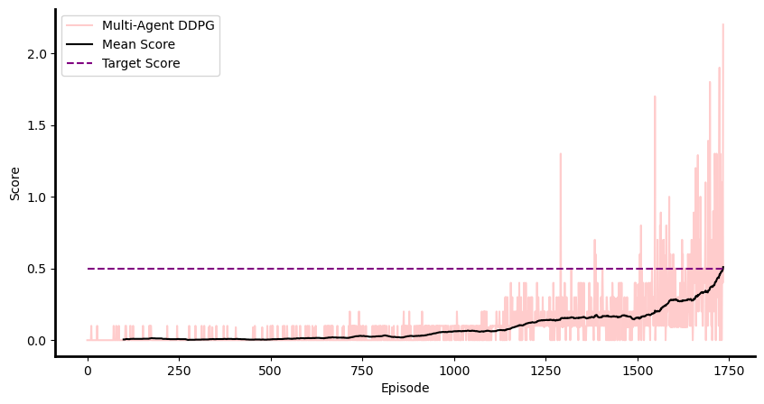

# Report

## 1. Introduction
In this project, an actor-critic method called "Deep deterministic policy
gradients" is used to solve Reacher environment. This algorithm uses a replay 
buffer to store past experiences (like DQN) which helps to de-correlate them and 
also help remember old experiences. This algorithm uses an actor to estimate actions
and a critic to estimate the Q(s, a).

## 2. DDPG Algorithm
I used **DDPG** to solve this environment. The actor used to estimate the actions is a 
multi-layer perceptron with two hidden layers; first layer with 256 and the second
layer with 128 nodes. Hidden layers have _ReLu_ and the output layer has _tanh_ 
activation function. The critic is used to estimate the `Q(s, a)` is the same neural
network except that it has 1 output node with identity activation function.
To select the actions in each state, we added some noise to the estimated action
using __Ornstein-Uhlenbeck__ process:

$dX_t = \theta(\mu - X_t) dt + \sigma dW_t$

## 3. Hyperparameters

| **Parameter**                   | **Value** |
|:--------------------------------|:---------:|
| $\gamma$                        |   0.99    |
| $\tau$                          |   0.01    |
| $lr_{actor}$                    |  0.0005   |
| $lr_{critic}$                   |  0.0005   |
| $\mu_{OHN}$                     |     0     |
| $\theta_{OHN}$                  |    0.1    |
| $\sigma_{OHN}$                  |    0.2    |
| noise_decay_factor              |   0.999   |
| target network update frequency |    10     |
| local network update frequency  |     1     |
| buffer size                     | 1,000,000 |
| batch size                      |    512    |
| target score                    |    0.5    |

where OHN, is the Ornstein-Uhlenbeck noise.

### 4. Training the agent
The agent exceeded the target score (0.5) in 1,735 episodes! 
Here is rewards plot collected during the agent training:

### 5. Future Improvements
In this project, a DDPG algorithm is utilized to train the agent. 
To improve the training, one way would be to use __share experience__ across 
multiple agents which can speed up the learning.

